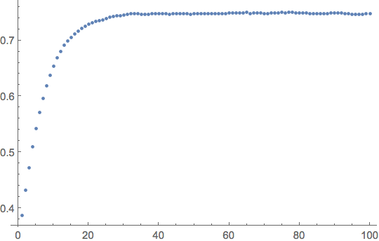
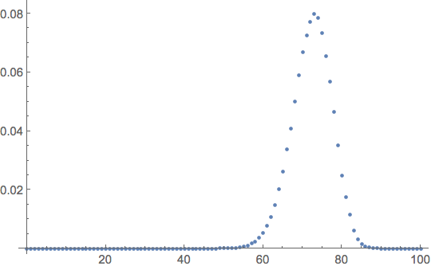

# OpenEPSim: Open Exclusion Process Simulation Tool

OpenEPSim simulates exclusion processes on finite lattices, such as the [ASEP](https://arxiv.org/abs/cond-mat/0611701).  It handles multi-species models, arbitrary local interactions involving 1 or more neighbouring sites, and open boundary conditions (periodic boundaries are not supported).  It collects statistics to produce time-averaged density profiles, distributions of the number of particles of each species, and counts of specified transitions allowing computation of average currents.

To define a model and run a simulation, all that is needed is to specify the transition matrix, and a few other parameters.  The system is then simulated using the [Gillespie algorithm](https://en.wikipedia.org/wiki/Gillespie_algorithm), and time-averaged statistics collected.

## Table of contents
* [Quick start guide](#quick-start-guide)
    * [Input configuration](#input-configuration)
    * [Results](#results)
* [Build and run instructions](#build-and-run-instructions)
* [Input format](#input-format)
* [Output format](#output-format)


## Quick start guide

OpenEPSim is written in Java.  Compiled versions are available [here](https://github.com/caley/OpenEPSim/releases), so that only the Java runtime (version 1.8) is required to run it.  As an example, we will run a simulation of the ASEP, with the configuration file [asep.json](samples/asep.json).  All input and output is in [JSON](https://www.json.org/) format.  

Unzip the latest [release](https://github.com/caley/OpenEPSim/releases), and change to the created directory.  We can run the simulation with the command
```shell
$ java -classpath openepsim-complete.jar openeps.OpenEPSimulation < samples/asep.json > asep-results.json
```
Let's now explain what that will do (or has done already if you're keen).

### Input configuration

The configuration file specifies the transition matrix for the open boundary ASEP, following the notation from [here](https://arxiv.org/abs/cond-mat/0609645).  We have taken boundary and bulk rates

> α = 0.29, β = 0.22, γ = 0.12, δ = 0.13, p = 1, q = 0.3.

We will compare our simulation output to the [exact results for the ASEP stationary state](https://arxiv.org/abs/cond-mat/0312457).  The boundary rates we have chosen correspond to parameters

> a = 2, b = 3, c = -0.2, d = -0.2.

We expect a bulk density b/(1 + b) = 0.75, and an average current (1 - q)*b/(1 + b)<sup>2</sup> = 0.13.

This is the configuration file asep.json (with most of the comments left out):
```javascript
{
  "L": 100,

  "tSkip": 0,

  "tMax": 500000,

  "nstates": 2,

  "transitions": [
      // Left boundary
      {
          "window": 1,
          "from": 1,
          "to": 1,
          "count": true,
          "rates": [
              [0, 0.12],
              [0.29, 0]
          ]
      },

      // Bulk hopping
      {
          "window": 2,
          "from": 1,
          "to": -2,
          "rates": [
              [0, 0, 0, 0],
              [0, 0, 1, 0],
              [0, 0.3, 0, 0],
              [0, 0, 0, 0]
          ]
      },

      // Right boundary
      {
          "window": 1,
          "from": -1,
          "to": -1,
          "rates": [
              [0, 0.22],
              [0.13, 0]
          ]
      }
  ]
}
```

First
```
"L": 100
```
sets the number of sites to 100.  Sites are labelled left to right (1, 2, ..., L), or right to left (-1, -2, ..., -L).  So for this example, both '100' and '-1' would refer to the same site.

As each site of the ASEP has two states (empty or occupied), we have
```
"nstates": 2
```

We'll look at the bulk part of the transition matrix first
```
{
    "window": 2,
    "from": 1,
    "to": -2,
    "rates": [
        [0, 0, 0, 0],
        [0, 0, 1, 0],
        [0, 0.3, 0, 0],
        [0, 0, 0, 0]
    ]
}
```
`"window": 2` specifies that this matrix applies to two neighbouring sites.  The `"from"` and `"to"` entries specify that the matrix is to be applied at sites (1,2), (2,3), ..., (-2, -1) = (99, 100) (because L = 100 in this example).  `"rates"` gives the local transition matrix, in the usual basis (see TODO REF), and so must be of size nstates<sup>window</sup>.  A transition matrix should have negative entries on the diagonal, so that the columns sum to zero.  OpenEPSim will insert the correct entries, so we can leave the diagonal entries as zero.

The left boundary matrix is specified by
```
{
    "window": 1,
    "from": 1,
    "to": 1,
    "count": true,
    "rates": [
        [0, 0.12],
        [0.29, 0]
    ]
}
```
It has `"window": 1` to specify that this matrix applies to a single site, and `"from"` and `"to"` are set to 1, so it is applied to the leftmost site.  `"rates"` specifies the injection and extraction rates (α = 0.29, and γ = 0.12).  `"count": true` tells OpenEPSim to count the number of times each event occurs - this allows us to measure the current (a little like the current counting deformation of the transition matrix).

The right boundary is similar, but it has `"from"` and `"to"` set to -1, so that it is applied to the rightmost site.

Finally, `"tMax": 500000` specifies how long to run the simulation for (simulation time units).  `"tSkip": 0` tells OpenEPSim to record statistics from the beginning of the run, but we could set it greater than zero to skip some some initial part.

### Results

In the above example, the simulation output is written to asep-results.json (a sample copy is [here](sample/asep-results.json)).  We'll look at just an edited snippet of it:
```
{
  "options": {...},
  "results": {
      "tTotal":1000000.0,
      "density":[
          [0.6132431964131151,0.56850637628425,0.527805856398517,0.4908249150892558,0.45781468242825724,0.4291742070221835,0.4036788321150717,0.3810893862450366,0.3621730165748032,0.3457414031521843,0.3313461146514231,0.3193108553868618,0.3091402647802975,0.30149941321612883,0.2947346600446128,0.2886469150880875,0.2840809862860413,0.2789701130844067,0.27493839893074945,0.2710943601832644,0.2680015108156449,0.2666654701975349,0.2646916318225673,0.2636124078290241,0.2607195958643374,0.25832814709865426,0.25755763357471323,...],
          [0.38675680358682923,0.4314936237157077,0.47219414360138884,0.5091750849106199,0.54218531757165,0.5708257929777809,0.5963211678849164,0.6189106137548992,0.6378269834251411,0.6542585968478035,0.6686538853484464,0.6806891446131257,0.6908597352196573,0.6985005867839079,0.7052653399553208,0.7113530849118339,0.7159190137140194,0.7210298869155123,0.7250616010691773,0.7289056398166264,0.7319984891842991,0.7333345298024254,0.7353083681774235,0.7363875921709198,0.7392804041355724,0.7416718529011976,0.742442366425203,...]],
    "speciesDensity":[
        [...],
        [..., 0.001118736056908636,0.0017204342463711195,0.0023663495266899926,0.003825900565996557,0.005295143266662378,0.007742624053335403,0.010858093246110399,0.014898323911741953,0.020276396491955916,0.026250638156498547,0.033754547867308145,0.04088399820997262,0.04997814370695406,0.05914699888937598,0.06684641469169673,0.07258066663597275,0.07720809205405621,0.07997873079099985,0.07848744030727464,0.0734971743550454,0.0656150913846412,0.05676905135710418,0.04650561025127506,0.035235662344451926,0.024991944279363597,0.01747788373072043,0.011703252514376504,0.006199613373435504,0.0031194748095986647,0.0014405987583663215,7.008031089185139E-4,3.671114354186905E-4,1.5407081463117363E-4,8.387621189168643E-5,1.5479669265784674E-5,0.0,0.0,0.0,0.0,0.0,0.0,0.0,0.0,0.0,0.0]],
    "counts":[
        [[0,46403],
         [178261,0]],null,null]}
  ...
}
```
The first entry `"options"` contains a complete copy of the input configuration (in this case asep.json).  This is to ease keeping track of simulation runs.

The actual results come under `"results"`.  The `"density"` item contains the per-site densities for species 0 and 1, i.e. the fraction of time each site is empty or occupied, respectively, so that pairwise the entries add to 1.  The density profile for species 1 is plotted here:



The bulk value is close to the expected value of 0.75.

The `"counts"` entry records injections (23093) and extractions (89006) at site 1.  The two 'null' elements are for the bulk and right boundary transitions, which left the `count` flag unset.  To compute the time-averaged current at the first site we divide the net entries by the total time to give (89006 - 23093) / 50000 = 0.13, which matches the expected value.

The `"speciesDensity"` entry records the fraction of time the lattice contained *exactly* k particles of each species (so 0  ≤ k ≤ L).  The species 1 results are plotted here:



## Build and run instructions

OpenEPSim uses [Maven](https://maven.apache.org/).  It uses the libraries [google-gson](https://github.com/google/gson) and [Apache Common Maths](http://commons.apache.org/proper/commons-math/), but Maven will take care of the dependencies.

To compile:
```
mvn compile
```

To run the test cases (this will take a few minutes):
```
mvn test
```

To produce a jar, run
```
mvn package
```
This will produce a jar with just the OpenEPSim code (target/openepsim-VERSION.jar), and a jar containing all the dependencies (target/openepsim-with-deps-VERSION.jar).

To run
```
java -classpath target/openepsim-with-deps-VERSION.jar openepsim.OpenEPSimulation < input.json > output.json
```


## Input format

The input configuration is given as a dictionary of key - value mappings in JSON format.

| Key          | Type                 | Description                                           |
|--------------|----------------------|-------------------------------------------------------|
| L            | Integer > 0          | Lattice length. |
| nstates      | Integer > 0          | Number of states per site (e.g nstates = 2 for the ASEP: empty or occupied). |
| transitions  | List                 | List of transition specifications (see below). |
| initialState | List of integers ≥ 0 | Initial lattice configuration.  First L taken if length greater than L, or right-padded with zeroes if length less than L. |
| seed         | Integer              | Seed for the random number generator.  Leave unset or set to 0 to let system choose the seed. |
| verbose      | Integer              | Set greater than zero for verbose output. |
| tMax         | Floating point > 0   | Simulation length (in simulation time units). |
| tSkip        | Floating point ≥ 0   | Skip tSkip time units before recording statistics. |

`transitions` is a list specifying the local transition matrices.  Each item is a dictionary of key - value mappings:

| Key          | Type                 | Description                                           |
|--------------|----------------------|-------------------------------------------------------|
| window       | Integer > 0          | Number of neighbouring sites the transition matrix applies to |
| from         | Integer              | First site to apply this matrix to.  Sites are labelled left-to-right 1, 2, ..., L, or right-to-left -1, -2, ..., -L. |
| to           | Integer              | Last site to apply this matrix to, indexed as for `from`.|
| count        | Boolean              | Count the number of time each transition occurs.  Aggregated across all sites this local transition matrix is applied to. |
| rates        | Array of floating point values | The local transition matrix.  Diagonal values can be left as zero and will be filled correctly.  Should be a square matrix of size nstates<sup>window</sup>. |

## Output format

The output of OpenEPSim is a dictionary of key - value mappings in JSON format:

| Key          | Type                 | Description                                           |
|--------------|----------------------|-------------------------------------------------------|
| options      |                      | The complete input configuration (see [above](#input-format)) |
| results      |                      | The collected results, described below. |
| finalState | List of integers ≥ 0 | Final lattice configuration. |
| runtime | Floating point value | The time taken to run this simulation (wall clock time). |

`results` is again a dictionary of key - value mappings in JSON format:


| Key          | Type                 | Description                                           |
|--------------|----------------------|-------------------------------------------------------|
| tTotal       | Floating point > 0   | Actual simulation length (in simulation time units).  |
| density      | List of list of floating point values | density[c] (length L list) is the time-averaged density profile species c.  That is, density[c][i] is the fraction of simulation time site i was occupied by species c.  |
| speciesDensity      | List of list of floating point values | speciesDensity[c][k] is the fraction of simulation time the lattice contained *exactly* k particles of species c. |
| counts       | List of array of integers | Count of number of times each transition occured.  counts[i] is null if the corresponding local transition specification does not have `count` set to true. |


