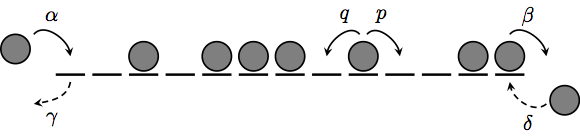

# Summary

OpenEPSim is a tool for running Monte Carlo simulations of exclusion processes - the canonical example of such models is the asymmetric exclusion process (ASEP) [@BlytheE07].  The ASEP describes the motion of particles on a one-dimensional lattice, where particles move stochastically with specified rates.  The rates for the open boundary ASEP are shown below, and allow particles to enter and exit at the lattice boundaries.

The ASEP (as we describe it here) is a continuous time Markov process, with the time evolution determined by the master equation.  The dynamics (the hopping rates) are encoded in the *transition matrix* (for an introductory review see [@GolinelliM06]).  The ASEP is a well-studied model, through exact results [@DerridaEHP93], approximate or phenomenological methods [@KolomeiskySKS98], and simulation studies.  However, there is ongoing interest in extensions and variations of the model - some examples include [@CrampeRRV16; @AyyerR17; @AyyerFR18].  The aim of OpenEPSim is to make simulating such variations as simple as defining the model mathematically.

An OpenEPSim simulation is configured by specifying the transition matrix of the model, in much the same way as it is specified mathematically.  It supports multi-species models, arbitrary local interactions involving 1 or more neighbouring sites, and open boundary conditions.  The model, once defined, is simulated using the Gillespie algorithm[@Gillespie76], and time-averaged statistics collected.  The implementation of the Gillespie algorithm is optimised, taking advantage of the local nature of the transition matrix.  The primary aim of OpenEPSim is to make defining and running simulations easy, but it also attempts to perform the simulations in an efficient manner.  Results of the simulations are output in JSON format, allowing easy import into analysis software.

Documentation, source code, and the compiled software can be found on the [OpenEPSim Github page](https://github.com/caley/OpenEPSim).

# References
